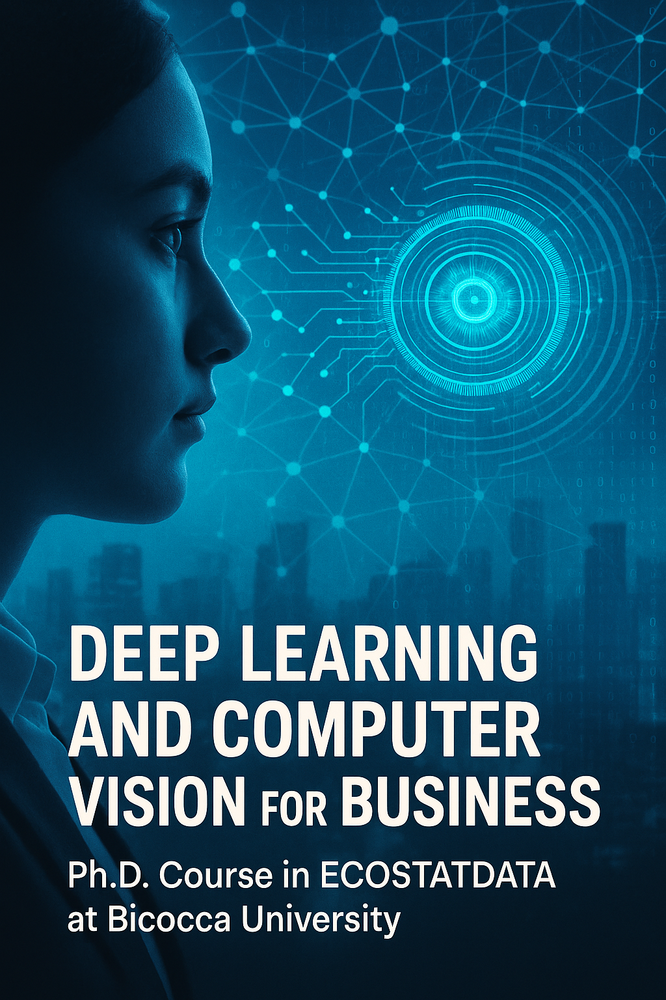

# Deep Learning and Computer Vision for Business

Ph.D. Course in [ECOSTATDATA at Bicocca University](https://www.unimib.it/didattica/offerta-formativa/dottorato-ricerca/corsi-dottorato/economia-statistica-e-data-science-ecostat)

This PhD course is designed to provide an in-depth understanding of how deep learning and computer vision techniques can be applied to solve business challenges. The course focuses on key practical applications, including retail product recognition, human pose estimation, and advanced image processing. Students will gain hands-on experience with PyTorch, developing models that address real-world business problems.

## Course Structure

The course is divided into several modules, each focusing on different aspects of deep learning and computer vision:

### 1. PyTorch and Computer Vision
This section introduces deep learning frameworks, with a focus on PyTorch. It covers basic Convolutional Neural Networks (CNNs) and their applications in computer vision.

**Subfolders:**
- **any_semantic_segmentation:** Explore semantic segmentation techniques with sample images.
- **basic_CNN:** Learn the fundamentals of CNN architecture.
- **CNN_finetuning:** Learn how to fine-tune pre-trained models, with datasets such as FashionMNIST.

### 2. Datasets and Retail Product Recognition
Learn to handle and preprocess retail product datasets for training deep learning models. Explore object detection and tracking techniques specifically tailored for retail environments.

**Subfolders:**
- **datasets/retail_products:** Contains images and annotations for retail products, divided into training and testing sets.
    - **annotations:** Annotations for the retail product dataset, split into train and test sets.
    - **images:** Product images used for training and testing.

### 3. Human Pose Estimation
Dive into human pose estimation techniques and their business applications, such as enhancing retail experiences or monitoring physical activities.

**Subfolders:**
- **human_pose_estimation:** Files related to human pose estimation projects.

### 4. Object Detection and Tracking
Advanced methods for detecting and tracking objects in images and video streams, with practical business applications in areas such as inventory management and customer behavior analysis.

**Subfolders:**
- **object_detection_tracking:** Resources for implementing object detection and tracking models.

## Other Resources

- [YOLO Training Notebook](https://github.com/PacktPublishing/Modern-Computer-Vision-with-PyTorch/blob/master/Chapter08/Training_YOLO.ipynb)
- [Object Detection with DETR](https://github.com/PacktPublishing/Modern-Computer-Vision-with-PyTorch/blob/master/Chapter15/Object_detection_with_DETR.ipynb)
- [OpenPose Sign Language Model](https://colab.research.google.com/github/changsin/DL/blob/main/notebooks/openpose_sign_language.ipynb#scrollTo=FOdkDhb6ga6N)

Additional materials and datasets, including retail product datasets, can be accessed through:
- [Retail Product Dataset on Kaggle](https://www.kaggle.com/datasets/hafizyusufheraldi/retail-product-dataset?resource=download)
- [Retail Product Checkout Dataset](https://www.kaggle.com/datasets/diyer22/retail-product-checkout-dataset/data)

